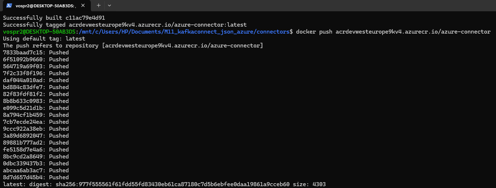
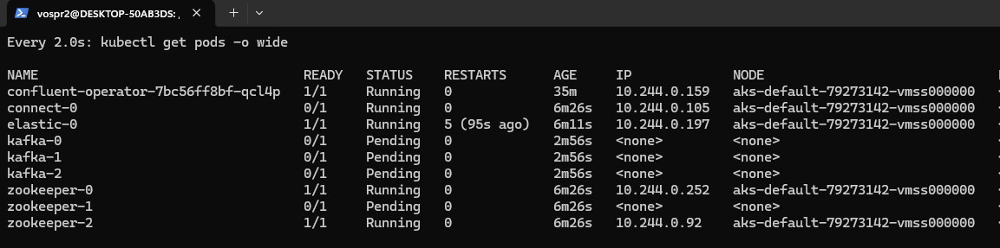
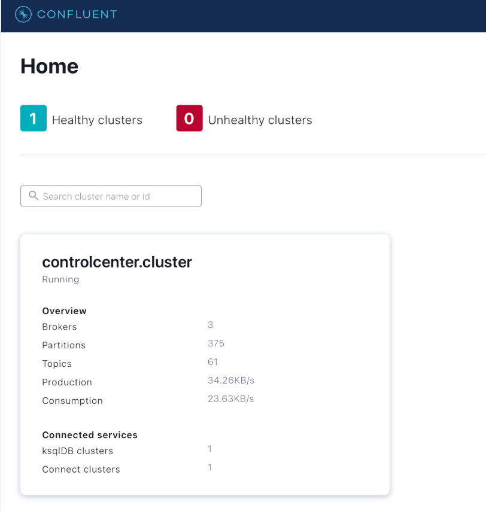
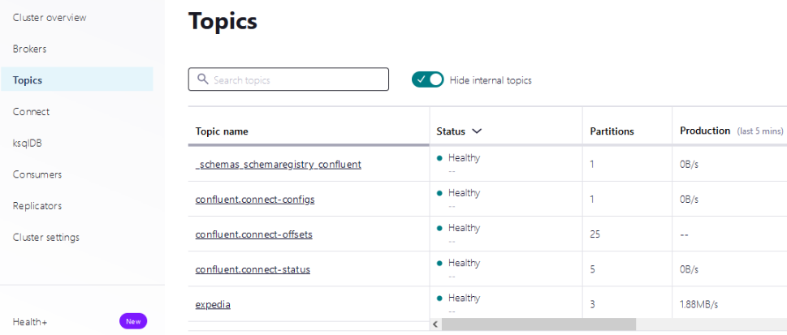
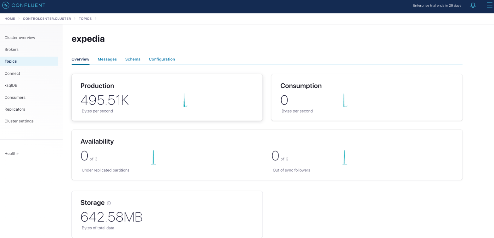
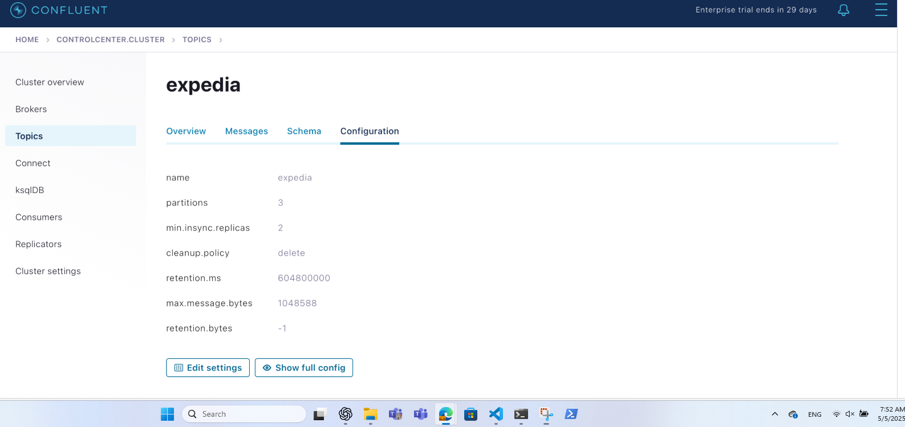
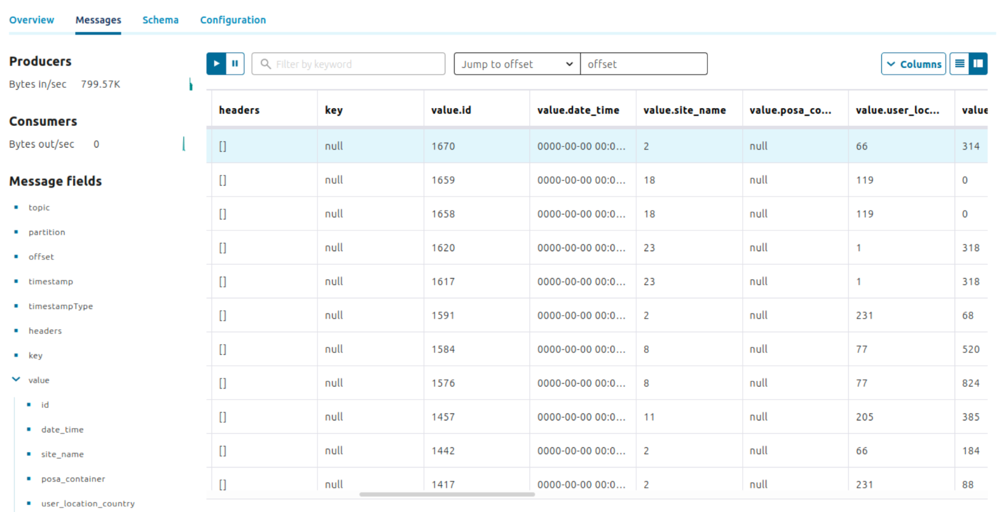

# KafkaConnect
---

https://github.com/Andrey-Vospr/M11_Kafka_Connect_Json

## Table of Contents

1. [Prerequisites](#prerequisites)
2. [Provision Terraform State in Azure](#provision-terraform-state-in-azure)
3. [Configure Terraform Backend](#configure-terraform-backend)
4. [Deploy Infrastructure](#deploy-infrastructure)
5. [Verify Azure Resources](#verify-azure-resources)
6. [Connect to AKS Cluster](#connect-to-aks-cluster)
7. [Configure Azure Container Registry](#configure-azure-container-registry)
8. [Build & Push Azure Connector](#build--push-azure-connector)
9. [Install Confluent Platform on Kubernetes](#install-confluent-platform-on-kubernetes)
10. [Create Kafka Topic](#create-kafka-topic)
11. [Verify Messages in Kafka](#verify-messages-in-kafka)

---

## 1. Prerequisites

Ensure the following tools are installed and authenticated on your machine:

- **Rancher Desktop** (or Docker Desktop)
- **Azure CLI** (`az`)
- **Terraform**
- **Helm**
- **kubectl**

## 2. Provision Terraform State in Azure

### 2.1 Login to Azure

   ```bash
   az login
   ```

### 2.2 Create Resource Group

   ```bash
   az group create \
     --name M11Kafka \
     --location westeurope
   ```

### 2.3 Create Storage Account

   ```bash
   az storage account create \
     --name m11kafkastorageaccount \
     --resource-group M11Kafka \
     --location westeurope \
     --sku Standard_LRS
   ```

### 2.4 Create Blob Container

   ```bash
   az storage container create \
     --name terraform-state \
     --account-name m11kafkastorageaccount
   ```
```

## 3. Configure Terraform Backend

1. **Fetch Storage Key**:
   ```bash
   az storage account keys list      --resource-group M11Kafka      --account-name m11kafkastorageacct      --query "[0].value" -o tsv
   ```

2. **Update `terraform/main.tf`** with:
   ```hcl
   terraform {
     backend "azurerm" {
       resource_group_name  = "M11Kafka"
       storage_account_name = "m11kafkastorageacct"
       container_name       = "terraform-state"
       key                  = "kafka-connect.tfstate"
     }
   }
   ```


## 4. Deploy Infrastructure

```bash
cd terraform/
terraform init
terraform plan -out=tfplan
terraform apply tfplan
```

_To destroy:_
```bash
terraform destroy
```

## 5. Verify Azure Resources

```bash
az resource list \
  --resource-group M11Kafka \
  --output table
```

## 6. Connect to AKS Cluster

1. **Retrieve Credentials**:
   ```bash
   az aks get-credentials      --resource-group M11Kafka      --name aks-m11kafka      --overwrite-existing
   ```
2. **Set Namespace**:
   ```bash
   kubectl config set-context --current --namespace confluent
   ```
```

## 7. Configure Azure Container Registry

```bash
az acr login --name acr-m11kafka
```

## 8. Build & Push Azure Connector

1. **Build Image**:
   ```bash
   docker build -t acr-m11kafka.azurecr.io/azure-connector:latest ./azure-connector
   ```
2. **Push Image**:
   ```bash
   docker push acr-m11kafka.azurecr.io/azure-connector:latest
   ```
<p align="center">
  
</p>
## 9. Install Confluent Platform on Kubernetes

```bash
helm repo add confluentinc https://packages.confluent.io/helm
helm repo update
helm install confluent-platform confluentinc/confluent-for-kubernetes
```

_Verify pods:_
```bash
kubectl get pods -o wide
```

<p align="center">
  
</p>

---

## 10. Create Kafka Topic

Create a topic named `expedia` with 3 partitions and replication factor 3:

```bash
kubectl exec kafka-0 -c kafka -- \
  kafka-topics --create \
    --topic expedia \
    --partitions 3 \
    --replication-factor 3 \
    --bootstrap-server kafka:9092
```

## 11. Verify in Kafka

1. **Open Control Center**  
   Navigate to: http://localhost:9021

<p align="center">
  
</p>

2. **Inspect Topic**  
   - Go to **Cluster > Topics**  
<p align="center">
  
</p>

   - Click on `expedia`  
<p align="center">
  
</p>
<p align="center">
  
</p>
   - Switch to the **Messages** tab to view incoming records  

<p align="center">
  
</p>

---

## 🎉 Done!
